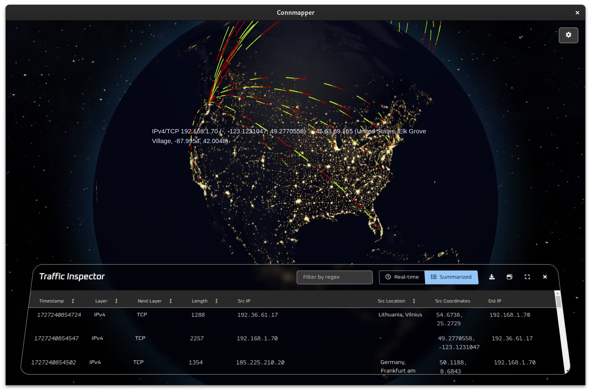
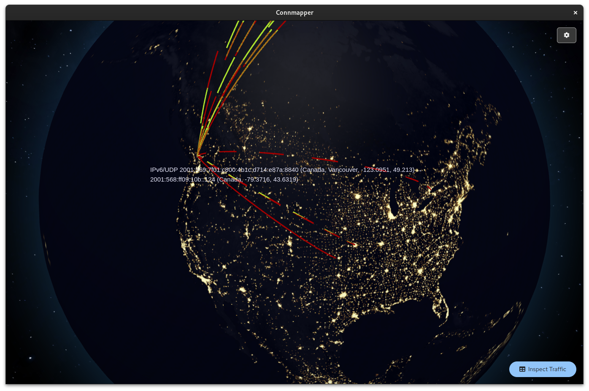
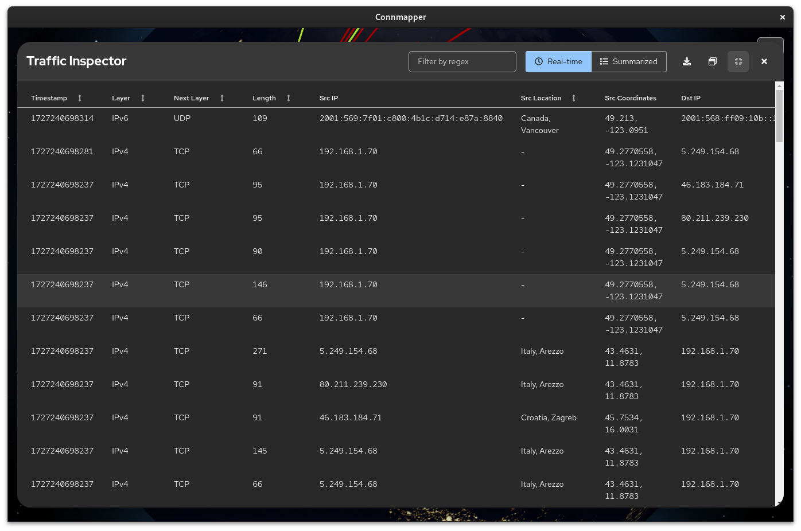
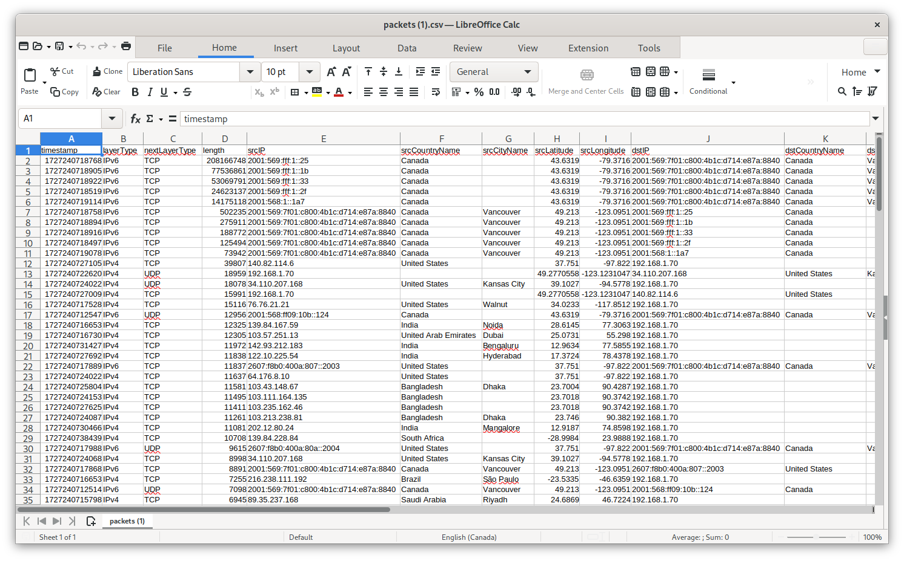

# Connmapper

System internet connection visualizer.

<br>

<p align="center">
  
</p>

[](https://github.com/pojntfx/connmapper/actions/workflows/hydrapp.yaml)

## Overview

Connmapper is an app to visualize your system's internet connections on a globe.

It enables you to:

- **Do real-time analysis**: Thanks to `libpcap`, Connmapper can get your system's packets in near real-time, and display their properties such as protocols, packet lengths or peer addresses.
- **Get visual insights**: By looking up the source and destination IPs for each connection in a local copy of the [MaxMind GeoIP2 database](https://www.maxmind.com/en/geoip2-databases), Connmapper can get the source and destination coordinates of every packet in your system and plot them on a globe.
- **Explore historical data**: Thanks to its integrated CSV export feature, Connmapper can also be used to aggregate connection data and analyze it externally.

## Installation

See [INSTALLATION.html](https://pojntfx.github.io/connmapper//docs/main/INSTALLATION.html).

## Tutorial

### 1. Setting Up the Database

Upon first launching Connmapper, it will ask you to enter your free license key for the GeoIP2 database. After entering it, it will download the database for you:


### 2. Selecting Your Capture Device

Once the database has been set up, you can choose your preferred capture device, which is the device you want to analyze packets from. On the first launch, it might ask you to temporarily give it admin privileges so that it can give itself permission to capture from network devices:


### 3. Getting Real-Time Insights

Once you've started tracing the device, a globe showing all the currently active connections on your system should appear. If you hover over one, you can get additional information:



By opening the traffic inspector through the inspect traffic button on the bottom right, you can get more detailed information:



Note that you can also minimize the traffic inspector or open it in a new window by clicking on the respective controls in the headerbar.

### 4. Exporting Historical Data

So far we've only looked at real-time data. To analyze historic data, you can select the summarized view in the traffic inspector. It is also possible to sort individual columns in the table, which for example allows you to find the host that you've sent the most data too:


Here you can also download the collected data as a CSV file for further analysis:



🚀 **That's it!** We hope you enjoy using Connmapper.

## Reference

### Settings

You can open the settings through the settings button in the top right; here you can configure many aspects of the application such as cache sizes or polling intervals (and enable "Cyberpunk mode" as an alternative theme):


### Command Line Arguments

All arguments passed to the binary will be forwarded to the browser used to display the frontend.

### Environment Variables

| Name                     | Description                                                                                                 |
| ------------------------ | ----------------------------------------------------------------------------------------------------------- |
| `HYDRAPP_BACKEND_LADDR`  | Listen address for the backend (`localhost:0` by default)                                                   |
| `HYDRAPP_FRONTEND_LADDR` | Listen address for the frontend (`localhost:0` by default)                                                  |
| `HYDRAPP_BROWSER`        | Binary of browser to display the frontend with                                                              |
| `HYDRAPP_TYPE`           | Type of browser to display the frontend with (one of `chromium`, `firefox`, `epiphany`, `lynx` and `dummy`) |
| `HYDRAPP_SELFUPDATE`     | Whether to check for updates on launch (disabled if OS provides an app update mechanism)                    |

## Acknowledgements

- [pojntfx/hydrapp](https://github.com/pojntfx/hydrapp) provides the application framework.
- [gopacket/gopacket](https://github.com/gopacket/gopacket) provides the library that the packets are being parsed with.
- [oschwald/geoip2-golang](https://github.com/oschwald/geoip2-golang) provides the library for reading the GeoIP2 database.

## Contributing

To contribute, please use the [GitHub flow](https://guides.github.com/introduction/flow/) and follow our [Code of Conduct](./CODE_OF_CONDUCT.md).

To build and start a development version of Connmapper locally, run the following:

```shell
$ git clone https://github.com/pojntfx/connmapper.git
$ cd connmapper
$ go generate ./... # Also see https://github.com/dennwc/flatpak-go-mod for updating the Flatpak manifest with Go dependencies and https://github.com/flatpak/flatpak-builder-tools/tree/master/node for JS dependencies
$ go install .
# Linux
$ sudo setcap cap_net_raw,cap_net_admin=eip "$(which connmapper)"
$ connmapper
# macOS
$ sudo connmapper
```

To start the backend and open the frontend in a browser instead of an application window during development, run the following:

```shell
$ go install .
# Start the backend in the first terminal
# Linux
$ sudo setcap cap_net_raw,cap_net_admin=eip "$(which connmapper)"
$ HYDRAPP_BACKEND_LADDR=localhost:1337 HYDRAPP_TYPE=dummy connmapper
# macOS
$ sudo HYDRAPP_BACKEND_LADDR=localhost:1337 HYDRAPP_TYPE=dummy connmapper
# Start the frontend in a second terminal
$ cd pkg/frontend
$ npm run dev
# Now open http://localhost:1234 in your browser
```

To build the DEB, RPM, Flatpak, MSI, EXE, DMG, APK, and static binaries for all other platforms, run the following:

```shell
$ hydrapp build
# You can find the built packages in the out/ directory
```

If you only want to build certain packages or for certain architectures, for example to only build the APKs, pass `--exclude` like in the following:

```shell
$ hydrapp build --exclude '(binaries|deb|rpm|flatpak|msi|dmg|docs|tests)'
```

For more information, see the [hydrapp documentation](https://github.com/pojntfx/hydrapp).

## License

Connmapper (c) 2024 Felicitas Pojtinger and contributors

SPDX-License-Identifier: AGPL-3.0-or-later
